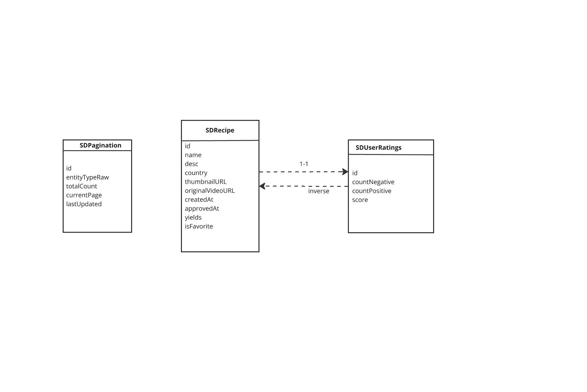

//
//  README.md
//  RecipeDataStore
//
//  Created by Nitin George on 02/03/2025.
//

# **RecipeDataStore**

The **`RecipeDataStore`** module provides a simple, reusable wrapper for data persistence, enabling efficient data saving and retrieval. It abstracts the complexities of data storage, offering a clean interface for developers to interact with data generated by the RecipeNetworking module.

---

## Database Schema

## **Features**

- **Save Recipe**: Add streamlined methods to save recipes fetched from the RecipeNetworking module to the data store.
- **Fetch Recipe**: Add straightforward methods to retrieve saved recipes for offline or local use.

---
