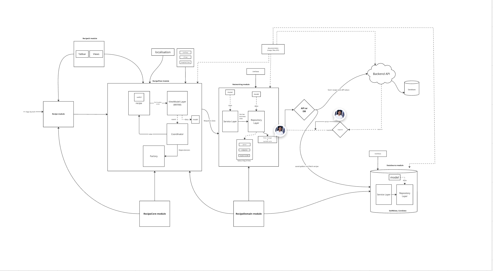
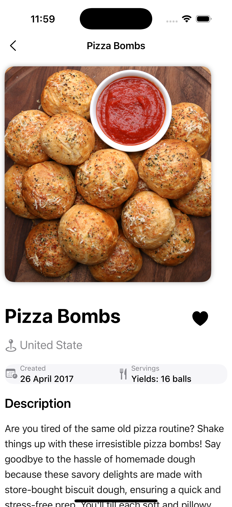

# Recipes
## Requirements
- iOS 17.0+
- Swift 5.9

## Architecture Overview
- SwiftUI-based application designed using the MVVM-C (Model-View-ViewModel-Coordinator) architecture for scalability, modularity, and testability. 
- Implements Repository Pattern for abstracting data sources (API + SwiftData) and Factory Pattern for dependency injection.
- Uses SwiftData for local persistence and async/await for concurrency.



## Running the Project

1. Clone the repo:
   ```bash
   git clone https://github.com/nithingeorge3/Recipes.git
    ```
      
## 🔑 Recipe API Key

The RapidAPI key has a monthly usage limitation, which might cause issues during API calls.  
Please update the key if required.

You can update the API key in the `APIKeyProvider.swift` file, located in the `RecipeNetworking` module. 

### 🔄 Deleting a Stored (Old/Expired) API Key

To delete a previously stored API key from the Keychain and ensure a clean state:

1. Open the **Recipe App**
2. Navigate to the **Menu** tab
3. Tap **Delete API Key**
4. Confirm by tapping **Delete**
5. *(Optional)* Delete the app to fully clear local storage and database

This ensures you're using the most up-to-date API key and avoids issues caused by outdated or expired keys.

```swift
// APIKeyProvider.swift
    private func fetchKeyFromBackend() async throws -> String {
        try await Task.sleep(nanoseconds: 1_000_000_000)
        
        let backendKey = "YOUR_API_KEY"

        return backendKey
    }
```

<details>
<summary>ToDo – Secure Key Management Plan</summary>
    •    🔐 Fetch API key securely from backend after login
    •    Store API key in Keychain instead of hardcoding
    •    Remove fallback key from source code
    •    Load per-environment API key from .xcconfig files
    •    [View RapidAPI Docs](https://rapidapi.com/apidojo/api/tasty/playground/)
    

## Approches
1. MVVM-C Architecture: Implemented MVVM-C using async/await.
2. Modular Design: Created separate modules for Network, UI, Feature, DataStore(local persistence using SwiftData).
3. Recipe List Pagination: Data is fetched from the API with pagination, which is integrated into the scrolling list for seamless user experience.
4. Model Layers: 
- DTO (Data Transfer Objects): Used only in the repository layer.
- SD Model(SwiftData model): Designed for local persistence.
- Domain Model: Used in the service layer for business logic.
- View-Specific Model: Used in the view layer for rendering UI.
5. Coordinator for Navigation: Coordinator pattern is used for managing navigation flow.

## limitations
1. I have used the same image for both the thumbnail and detail views. In a real scenario, I would resize the image for the thumbnail and save it separately, making it more efficient to decode and render.
2. Due to time constraints, I used simple Git commit messages. However, in a real work environment, I follow proper commit conventions, use feature branches, and submit pull requests (PRs). I prefer maintaining develop and master branches, but for this project, I committed directly to main.
3. Pending unit test cases.
4. Accessibility/VoiceOver support, DynamicType increase, Dark mode, SwiftData migration has not been implemented.
5. UI test cases are not covered, but I have included UI testing using Previews and snapshot testing.

## Known Issues & Future Improvements
1. I noticed a couple of issues that may require further investigation. Given more time, I would refine data handling and optimize UI updates to ensure the best user experience. These improvements would be prioritised in a production environment.

## Data storage
1. SDRecipe → Has a one-to-many relationship with SDUserRating.
2. SDPagination
3. SDUserRatings
    
## Screenshots
### iPhone Screens
|||||||||
### iPad Screens
|||

## Modules
1. RecipeNetworking: Provides a simple, reusable API wrapper around the network back end, facilitating data retrieval. It abstracts the complexity of networking and parsing, offering a clean interface for developers to interact with API endpoints.
2. RecipeDataStore: Provides a simple, reusable wrapper for data persistence, enabling efficient data saving and retrieval. It abstracts the complexities of data storage, offering a clean interface for developers to interact with data generated by the RecipeNetworking module.
3. RecipeDomain: Provides bridge between RecipeNetworking and RecipeDataStore. It avoiding teh circular dependency.
4. RecipeFlow: Provide Recipe listing, detail, favourite and menu
5. RecipeUI: provide tababar customisation and other reusable UI components.

## Environment Configuration (.xcconfig)

The app supports multiple environments using `.xcconfig` files for clean configuration management:

| Target        | Config File                | Description               |
|---------------|----------------------------|---------------------------|
| `recipe`      | `Recipe-Release.xcconfig`  | Production environment    |
| `recipeDev`   | `Recipe-Debug.xcconfig`    | Development environment   |
| `recipeStg`   | `Recipe-Staging.xcconfig`  | Staging / QA environment  |

Each configuration file defines:

```xcconfig
RECIPE_BASE_URL = tasty.p.rapidapi.com
RECIPE_END_POINT = /recipes/list
BUNDLE_IDENTIFIER = com.recipe.staging
APP_NAME = RecipeStg
