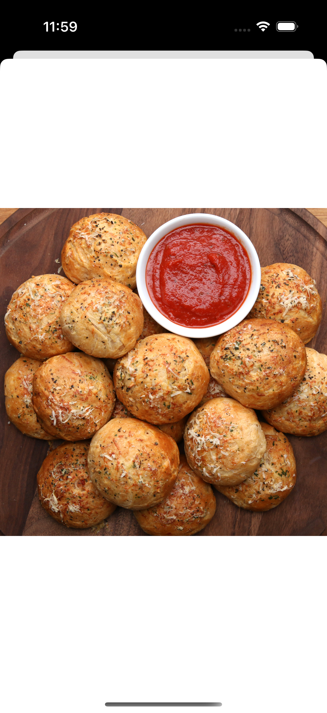

# Recipes
## Requirements
- iOS 16.0+
- Swift 5.9

## Overview
SwiftUI-based application designed using the MVVM-C (Model-View-ViewModel-Coordinator) architecture for scalability, modularity, and testability.

## Approches
1. MVVM-C Architecture: Implemented MVVM-C using async/await.
2. Modular Design: Created separate modules for Network (API interactions) and DataStore (local persistence using SwiftData).
3. Recipe List Pagination: Data is fetched from the API with pagination, which is integrated into the scrolling list for seamless user experience.
4. Model Layers: 
- DTO (Data Transfer Objects): Used only in the repository layer.
- SD Model(SwiftData model): Designed for local persistence.
- Domain Model: Used in the service layer for business logic.
- View-Specific Model: Used in the view layer for rendering UI.
5. Coordinator for Navigation: Coordinator pattern is used for managing navigation flow.

## limitations/issues
1. I have used the same image for both the thumbnail and detail views. In a real scenario, I would resize the image for the thumbnail and save it separately, making it more efficient to decode and render.
2. Due to time constraints, I used simple Git commit messages. However, in a real work environment, I follow proper commit conventions, use feature branches, and submit pull requests (PRs). I prefer maintaining develop and master branches, but for this project, I committed directly to main.
3. Pending: Unit test cases and testing.
4. SwiftData migration has not been implemented.
5. UI test cases are not covered, but I have included UI testing using Previews.
6. Accessibility features are not included.
7. Bugs
    

## Data storage
1. SDRecipe → Has a one-to-many relationship with SDUserRating.
2. SDPagination → Manages pagination data.
3. SDUserRatings → Not yet integrated with the UI.
    
## Screenshots
### iPhone Screens
|||||||||
### iPad Screens
|||

## Modules
1. RecipeNetworking: Provides a simple, reusable API wrapper around the network back end, facilitating data retrieval. It abstracts the complexity of networking and parsing, offering a clean interface for developers to interact with API endpoints.
2. RecipeDataStore: Provides a simple, reusable wrapper for data persistence, enabling efficient data saving and retrieval. It abstracts the complexities of data storage, offering a clean interface for developers to interact with data generated by the RecipeNetworking module.
3. RecipeDomain: Provides bridge between RecipeNetworking and RecipeDataStore. It avoiding teh circular dependency.
